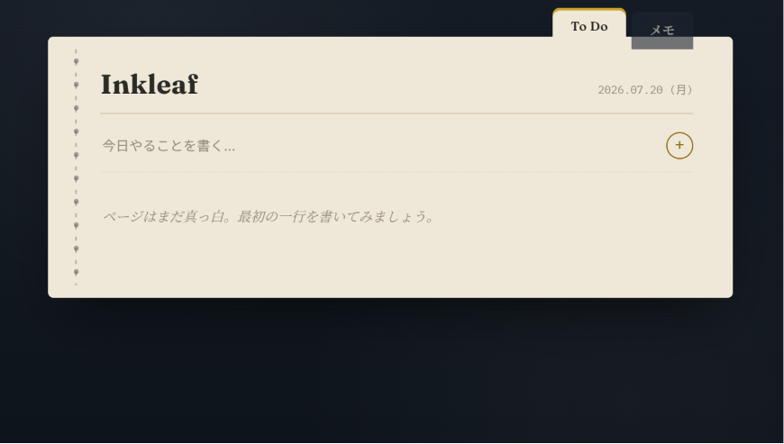
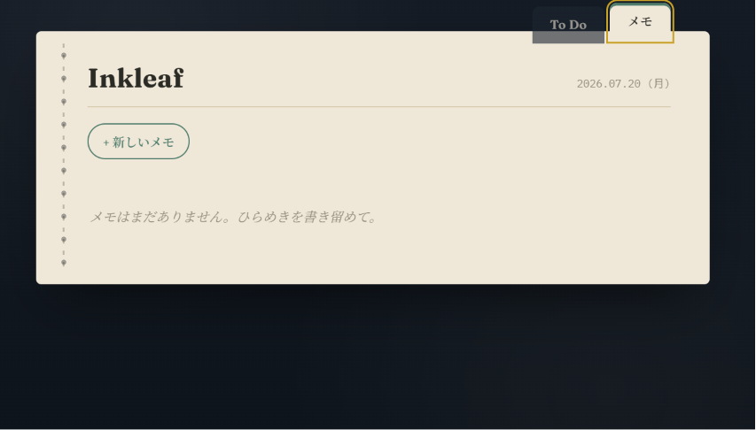

# Inkleaf

## 概要
「Inkleaf」は、紙とインクの手帳をモチーフにした、ToDoリストとメモ帳を兼ねたシングルページのWebアプリ。HTML・CSS・JavaScriptのみで構成している。

## 作成目的
日々のタスク管理と、ちょっとした思いつきのメモ書きを1つの画面で完結させたいという思い付きから作成しました。はじめはそれほど複雑でないものを作成したいということで、1ファイルにまとまる程度のもので作成した。

## 使用技術
- HTML
- CSS3(カスタムプロパティ、疑似要素、CSSアニメーション、`prefers-reduced-motion`対応)
- JavaScript(Vanilla JS / ES6、外部ライブラリなし)

## 主な機能
- **ToDoリスト**
  - タスクの追加(入力欄でEnter、または+ボタン)
  - チェックによる完了操作(インクが滲むようなアニメーション、取り消し線表示)
  - ホバー時に表示される削除ボタン
  - 残タスク数の自動カウント表示
- **メモ帳**
  - 付箋風メモカードの追加
  - 入力に応じて高さが自動で伸びるテキストエリア
  - 作成時刻の表示
  - メモの削除
- タブ切り替えでToDoとメモを1画面内で行き来できる構成
- スマートフォン幅まで対応したレスポンシブレイアウト
- キーボード操作時のフォーカスリング表示、`prefers-reduced-motion`によるアニメーション抑制

## 画面
- 紺色の背景(机)の上に、紙色のノートが1冊置かれているレイアウト
- ノート左端に、手帳の綴じ糸を模したステッチ模様
- 上部に「To Do」「メモ」の2つのタブ(実物の手帳の見出しタブ風デザイン)
- ToDoタブ:罫線風の入力欄、インク型チェックボックス付きのタスク一覧
- メモタブ:上辺の色がアクセントになった付箋カードのグリッド表示

## 環境構築
1. `inkleaf.html` をダウンロードします。
2. ブラウザ(Chrome / Edge / Safari / Firefoxなどの最新版)でファイルを直接開きます。

ローカルサーバーの起動やパッケージのインストールは不要です。

## 今後改善したいこと
- `localStorage`などを使ったデータの永続化(現状はページを再読み込みするとデータが消えます)
- タスクの並び替え(ドラッグ&ドロップ)
- メモの色を手動で選べる機能
- ダークモード/ライトモードの切り替え機能
